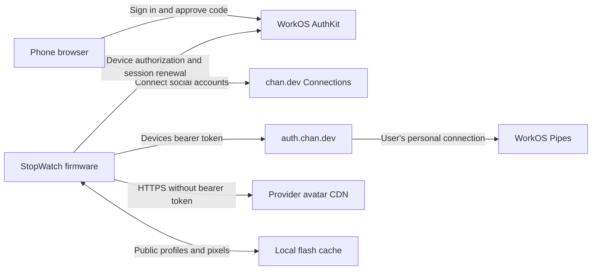

# Architecture

> **Current application: offline conference badge (September 17, 2026).**
> Read [conference-badge.md](conference-badge.md) for the current six-page UI,
> manual setup, radio policy and storage model, and
> [conference-clock.md](conference-clock.md) for repeatable flashing.
> The connected badge/voice behavior below is the retained historical application.
> Hardware geometry, pin assignments, calibrated IMU mapping, dependency pins,
> and partition-preservation constraints remain applicable.

The StopWatch renders and caches the badge locally. WorkOS supplies device authorization and sessions; chan.dev's existing identity service retrieves the signed-in user's connected social profiles through Pipes.

Active service source is maintained outside this firmware repository, in the private `chantastic/chan-services` monorepo. The gateway is at `~/Developer/chan-services/apps/devices`, serving `devices.chan.dev` through the separate Auth Worker's private `DevicesIdentity` binding. Auth and Social share that monorepo while retaining their own deployment and security boundaries. The local `gateway/` directory is a historical source snapshot; do not edit or deploy it as the active service. Building firmware does not deploy any service. See [voice replies](voice-replies.md) for the flow and verification status, and the monorepo's `docs/deployment.md` for current release ownership.

## Source map

All paths below are relative to `firmware/devices_badge/`.

| File | Responsibility |
| --- | --- |
| `devices_badge.ino` | Startup, main loop, AuthKit device flow, saved session, input dispatch, USB diagnostics |
| `settings.h` | Settings screens and temporary Wi-Fi captive portal |
| `profile.h` | Workspace discovery, provider refresh scheduling, avatar loading, cache activation |
| `profile_urls.h` | Provider-specific profile and avatar URL validation |
| `profile_store.h` | Bounded, context-checked LittleFS profile records and durable invalidation |
| `background_http.h` | One background HTTPS worker with explicit request/result ownership |
| `account_paging.h`, `badge_styles.h` | Connected-account order, layout selection, and saved-style migration |
| `button_gesture.h`, `orientation_filter.h` | Pusher chord handling and accelerometer settling |
| `badge.h` | Per-provider `init()` layouts, ASCII portraits, and QR rendering |
| `avatar_decode.h`, `vendor/stb_image.h` | Bounded baseline/progressive JPEG decoding in PSRAM |
| `trust.h`, `avatar_trust.h`, `linkedin_avatar_trust.h` | Public server certificate roots |
| `init_wordmark.h`, `github_mark.h` | Static branding masks, separate from dynamic user portraits |
| `voice_recorder.h` | Worker-owned bounded microphone capture and canonical WAV output |
| `voice_reply.h`, `voice_reply_state.h` | Reply app, hold gesture, explicit-send gate, saved receipt recovery |
| `voice_reply_ui.h` | Round-screen paginated inbox, recording, transcript review, and status views |

The canonical `chan-services/apps/devices` gateway owns provider requests, usage limits, sender/target
validation, and durable reply receipts. Shared Auth owns token verification,
fresh session checks, personal workspace resolution, and narrowly approved
private Pipes credential access. The gateway has no WorkOS environment secret
or browser authentication implementation. Existing profiles continue using the
original endpoints; this feature is not a migration of those routes.

## Authentication and existing service contract

`CLIENT_ID` in the sketch identifies chan.dev's public **Production Devices** application. Device authorization calls `POST https://api.workos.com/user_management/authorize/device`; polling and refresh use `POST https://api.workos.com/user_management/authenticate`.

The device accepts sessions received over certificate-validated WorkOS HTTPS after checking client, issuer, returned user, expiration, and requested organization context. This claim check is not an offline JWT signature verifier. The existing backend independently verifies the bearer token and determines the user's permitted workspace and personal Pipes connection.

| Endpoint on `https://auth.chan.dev` | Firmware expectation |
| --- | --- |
| `GET /devices/workspace` | Authenticated response with `state: "ready"` and `organizationId`; the firmware then requests an organization-scoped WorkOS session |
| `GET /devices/x` | The authenticated user's X profile |
| `GET /devices/linkedin` | The authenticated user's LinkedIn name/photo and separately saved public profile URL |
| `GET /devices/github` | The authenticated user's GitHub profile |
| `/connections`, `/connections#linkedin`, `/connections#github` | Browser setup destinations shown as QR codes |

A successful provider response has `state: "connected"` and a `profile` object containing `id`, `name`, `handle`, `url`, and `avatarUrl`. LinkedIn and GitHub responses also identify `provider`. A missing LinkedIn public link uses null `url` and `handle`; the badge shows explicit link-setup guidance rather than guessing a URL. GitHub can have a null avatar URL. Validators in `profile.h` and `profile_urls.h` are authoritative for accepted IDs, handles, URLs, hosts, and bounds.

Unavailable or rate-limited responses preserve an existing matching badge and schedule a retry. Disconnection or rejected access invalidates affected data; a profile endpoint's HTTP 401 clears the authenticated profile context. Provider tokens remain on the service side. The firmware sends its WorkOS bearer only to the exact workspace/profile endpoints, never to image hosts.

## Startup, refresh, and rendering

Startup restores the saved account and session context, then loads matching flash records and draws the badge before starting network requests. Each provider has one `init()` ASCII layout. Previously saved style choices normalize to that layout, and a changed packed preference is queued for one save after the normal debounce. The selected account is preserved. Restoring a badge does not establish a live authenticated session. After Wi-Fi and session renewal, the firmware checks all three profile endpoints in the background.

One FreeRTOS worker handles HTTPS. The main loop polls owned results without waiting for network completion. Authentication responses are consumed even if connectivity drops after completion, so a rotated refresh token is not lost. Rendering, avatar decoding, hashing, and file writes remain on the main task.

Each provider owns a RAM profile and a 400 × 400 RGB565 avatar canvas. Account paging, QR expansion, and rotation use those records without HTTP. Blue pages through connected accounts. Yellow is reserved for future layouts and leaves the badge unchanged; either pusher still returns from Settings. An unchanged remote account ID and avatar URL reuse existing pixels. If that account's new image fails, its old image can remain while another attempt is scheduled. A different remote account cannot inherit the previous account's image.

Successful boot/manual refreshes do not enable continuous provider polling. Retryable failures use a later retry, and session renewal runs independently. Selected-account changes save after a short debounce. Rotation uses local BMI270 measurements and does not write to flash.

## Persistent profile store

LittleFS uses the existing partition labeled `ffat`: offset `0x610000`, length `0x9E0000` (9.875 MiB). The label comes from the selected partition scheme; the mounted filesystem is LittleFS. The application slots and NVS layout are unchanged.

There are three provider files. Each contains a 64-byte versioned header, at most 4,096 bytes of metadata, and either no avatar or exactly 320,000 bytes of RGB565 pixels. Metadata contains the public client ID, owner ID, workspace ID, remote profile ID, name, handle, profile URL, and avatar URL. Three complete avatars occupy 960,000 bytes plus headers and metadata. A save can temporarily require one additional record.

The loader requires a separately saved, previously verified `offline_ctx` to match the saved session, then checks each file's provider, owner, workspace, client, schema, bounds, URLs, and SHA-256. It validates in scratch memory before replacing a RAM entry. This detects corruption and incorrect context; it is not cryptographic protection against someone who can rewrite the device's flash.

Saves write and synchronize a temporary file, verify it, and atomically rename it over the old record. Verified unchanged content skips the write. A durable NVS block mask prevents invalidated records from returning after a failed deletion or interrupted replacement. Authentication-context changes invalidate the offline context and all providers; provider disconnection invalidates that provider. The filesystem records its first format attempt and does not automatically format after later mount errors.

## Build and verification

The established toolchain is ESP32 Arduino core **3.3.10**, M5Unified **0.2.19**, M5GFX **0.2.26**, and ArduinoJson **7.4.3**. The application slot is 3,145,728 bytes. The build reports application size and static/global memory use; generated binaries remain outside Git.

`scripts/test.sh` runs host checks against production helpers and extracted production functions. Coverage includes provider and workspace isolation, URL validation, account/layout selection, migration of all 216 combinations of prior saved styles, button and orientation behavior, transport cancellation and response ownership, token rotation, storage corruption, bounded records, and injected file/NVS failures. These simulations complement compiling the complete sketch; they do not emulate the display or radio.

The private hardware check restored all three saved profiles and avatars in **1,260 ms with Wi-Fi disabled** and **1,300 ms on a normal restart**, before network requests. The three offline frames matched the online frames pixel for pixel. All three normal, expanded, and offline profile QRs decoded correctly, including through the circular display aperture. Saved alternative styles reset to `init()` and stayed reset after restart. Yellow preserved the current badge and expanded QR; blue account paging and Settings dispatch passed. Reconnection made three profile requests, zero avatar requests, and zero cache writes because the data was unchanged. These are measured samples, not startup guarantees. The check exercised shared button dispatch; it did not measure physical touch latency or interrupt real flash writes with power loss.

Private captures, device identifiers, session logs, and full-device backups are excluded from this repository.
